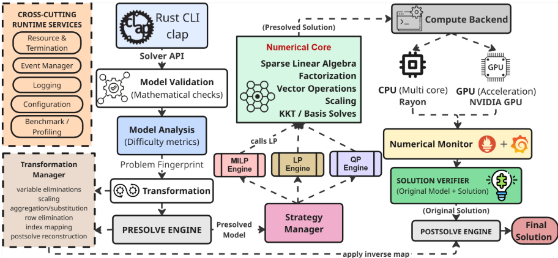
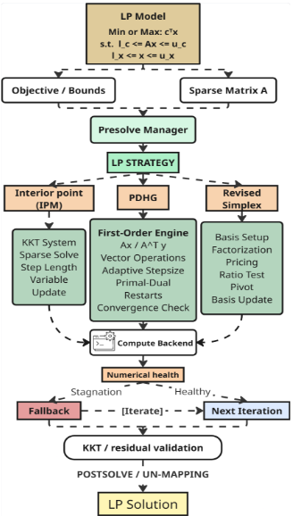
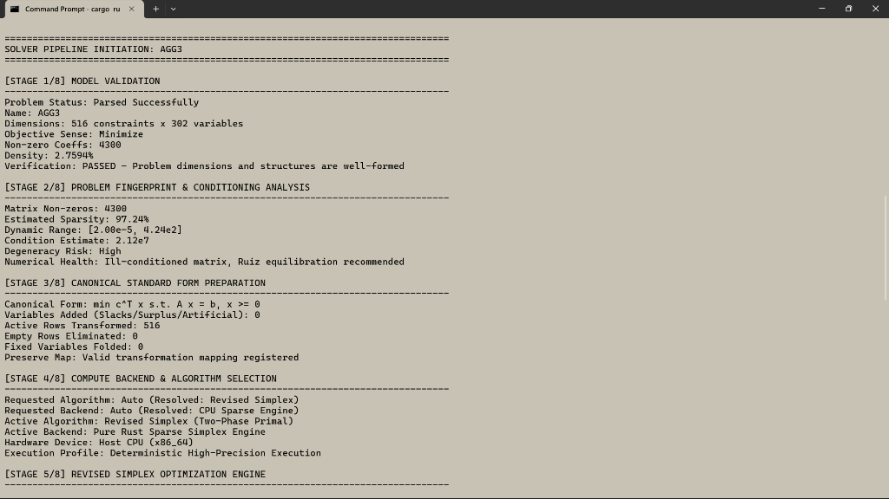
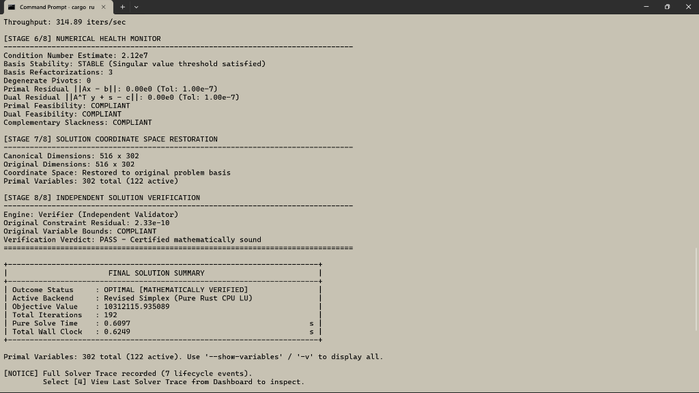

# Yukti-Samadhata (युक्ति-समाधाता)

<div align="center">

<!-- Team Logo -->


<br />

# युक्ति-समाधाता — Yukti-Samadhata
### Indigenous GPU-Accelerated Mathematical Optimization Solver Core
**A Sovereign, First-Principles Alternative to FICO Xpress, IBM ILOG CPLEX, and Gurobi**

<p align="center">
  
  
  
  
</p>

<p align="center">
  
  
  
  
  
  
  
</p>

```
· · · · · · · · · · · · · · · · · · · · · · · · · · · · · · · · · · · · · · ·
:   __   __      _   _     _      ____                       _ _            :
:   \ \ / /_   _| |_| | __(_)    / ___|  __ _ _ __ ___   __ _| | |__   __   :
:    \ V /| | | | __| |/ /| |____\___ \ / _` | '_ ` _ \ / _` | '_ \ / _` |  :
:     | | | |_| | |_|   < | |_____|__) | (_| | | | | | | (_| | | | | (_| |  :
:     |_|  \__,_|\__|_|\_\|_|    |____/ \__,_|_| |_| |_|\__,_|_| |_|\__,_|  :
:                                                                           :
:                     Y U T K I - S A M A D H A T A                         :
:             SOVEREIGN GPU-ACCELERATED OPTIMIZATION ENGINE                 :
· · · · · · · · · · · · · · · · · · · · · · · · · · · · · · · · · · · · · · ·
```

</div>

> **Yukti-Samadhata** (*युक्ति-समाधाता* — Sanskrit for *Strategic Reasoner & Problem Resolver*) is an indigenous, first-principles, high-performance mathematical optimization solver core engineered in 100% pure memory-safe Rust with native NVIDIA CUDA GPU acceleration and multi-core Rayon parallelization. Developed by **Team Caffeine Coders** for **Mangalore Refinery and Petrochemicals Limited (MRPL)** under **Problem Statement ID 26119**, it provides an uncompromised, sovereign alternative to foreign proprietary engines (IBM ILOG CPLEX, FICO Xpress, Gurobi) for mission-critical industrial scheduling, crude blending, power dispatch, and supply chain logistics.

---

## 📑 Table of Contents

- [National Significance & Problem Statement](#-national-significance--problem-statement-id-26119)
- [Key Highlights & Sovereign Innovations](#-key-highlights--sovereign-innovations)
- [Core System Architecture](#-core-system-architecture)
- [LP Optimization Engine Architecture](#-lp-optimization-engine-architecture)
- [Empirical Results & Benchmark Validation](#-empirical-results--benchmark-validation-yukti-results)
- [Mathematical Foundations & Dual Engines](#-mathematical-foundations--dual-engines)
- [Numerical Stability & Rigorous Safeguards](#-numerical-stability--rigorous-safeguards)
- [Competitive Benchmarks & Solver Comparison](#-competitive-benchmarks--solver-comparison)
- [Workspace Crate Topology](#-workspace-crate-topology)
- [Zero-Falsification Hardware Integrity Policy](#-zero-falsification-hardware-integrity-policy)
- [Getting Started & Installation](#-getting-started--installation)
- [Command-Line Interface (CLI) Guide](#-command-line-interface-cli-guide)
- [Rust API Integration Quickstart](#-rust-api-integration-quickstart)
- [Team & Acknowledgments](#-team--acknowledgments)
- [License](#-license)

---

## 🇮🇳 National Significance & Problem Statement (ID: 26119)

### 🎯 Problem Statement Overview
| Parameter | Description |
| :--- | :--- |
| **Problem Statement ID** | **26119** |
| **Problem Statement Title**| **Indigenous GPU-Accelerated Optimization Solver (Sovereign Alternative to Express / CPLEX)** |
| **Organization** | **Mangalore Refinery and Petrochemicals Limited (MRPL)** |
| **Department** | **Mangalore Refinery and Petrochemicals Limited (MRPL)** |
| **Category** | **Software** |
| **Theme** | **Smart Automation** |
| **Developing Team** | **Team Caffeine Coders** |

### 🏭 The Strategic Industrial Challenge
Almost every industrial optimization workflow across India's energy, refining, petrochemical, power grid, defense logistics, and manufacturing sectors relies exclusively on a handful of foreign commercial optimization solvers:
- **IBM ILOG CPLEX** (USA)
- **FICO Xpress** (USA/UK)
- **Gurobi Optimizer** (USA)

These foreign engines sit directly behind continuous refinery scheduling, crude distillation unit (CDU) optimization, multi-component crude blending, power system security-constrained economic dispatch (SCED), petrochemical cracking unit coordination, and strategic supply chain networks.

### ⚠️ Critical Strategic Vulnerabilities Addressed
1. **Exorbitant Recurring License Costs:** Multi-million-rupee recurring annual core-locked and floating licenses pose heavy financial burdens on Indian PSUs and enterprises.
2. **Proprietary Black-Box Architecture:** Zero visibility into internal algorithmic choices, pivot selection rules, barrier preconditioning, or factorization routines. Indian engineers cannot audit, customize, or inspect the solver core to accommodate specific domestic operational realities.
3. **Geopolitical & Technological Vulnerability:** Complete dependence on foreign software creates strategic supply-chain and national security risks for vital public infrastructure (oil refineries, power grids, strategic petroleum reserves).
4. **Limitations of Existing Open-Source Alternatives:** Existing open-source solvers (COIN-OR CBC, HiGHS, GLPK, SCIP) have advanced significantly, but often encounter severe computational bottlenecks, memory exhaustion, or divergence when exposed to large-scale, highly degenerate, ill-conditioned matrices typical of petrochemical refineries and crude blending networks.
5. **No Derivative Wrapper Policy:** In accordance with the mandate, **Yukti-Samadhata is not a wrapper or binding around any existing open-source C/C++ solver library**. It is built **100% from first mathematical principles** from the ground up in memory-safe Rust.

---

## ⚡ Key Highlights & Sovereign Innovations

- **100% Ground-Up Mathematical Formulation in Pure Rust:**
  Engineered with zero unsafe memory compromises, eliminating buffer overflows, memory leaks, and segmentation faults inherent in legacy Fortran/C/C++ solver codebases.
- **Dual-Engine Continuous LP Core:**
  - **Revised Simplex Engine (`yukti-lp::simplex`):** High-precision corner Basic Feasible Solutions (BFS), scaled partial-pivoting LU basis factorization, Harris two-pass ratio test, Dantzig and steepest-edge pricing, and Bland’s anti-cycling safeguards.
  - **First-Order PDHG / PDLP Engine (`yukti-lp::pdhg`):** Primal-Dual Hybrid Gradient saddle-point solver designed for hyper-scale sparse linear programs where interior-point methods (IPM) or Simplex stall due to cubic factorization complexity.
  - **Interior Point Method (IPM) Interface:** Primal-dual path-following predictor-corrector foundation for dense constraint regimes.
- **Pluggable Hardware Backends (CPU & GPU Acceleration):**
  - **Multi-Core CPU (Rayon):** Lock-free parallel linear algebra, multi-threaded matrix scaling, and sparse vector operations.
  - **Native NVIDIA CUDA Driver API Acceleration:** Embedded JIT-compiled PTX kernels executing warp-synchronous parallel reductions, scalar/warp CSR sparse matrix-vector products (SpMV), and vector updates directly on physical GPU VRAM without reliance on external CUDA runtimes or proprietary toolchains.
- **Dynamic Numerical Health Sentinel:**
  Continuous monitoring of matrix condition numbers, singular value bounds, degenerate pivot occurrences, basis condition degradation, and stagnation triggers with automatic adaptive step size and restart mechanisms.
- **Presolve & Ruiz Matrix Equilibration:**
  Dynamic scaling balancing row and column $\ell_\infty$ norms to mitigate extreme numerical ranges ($> 10^7$) in refinery blending matrices before algorithmic dispatch.
- **Non-Trusting Independent Verifier (`yukti-verifier`):**
  Completely decoupled validation engine that evaluates the raw unscaled original model against the computed primal-dual solution, independently certifying primal feasibility, dual feasibility, bounds compliance, and complementary slackness.
- **Air-Gapped Sovereign Authentication (`yukti-auth`):**
  Zero-network local security subsystem employing `Argon2id` password hashing and cryptographically secure recovery codes for industrial audit logging and operator access control.

---

## 🏛 Core System Architecture

<!-- Core System Architecture Tag -->
<div align="center">
  
  <p><em>Figure 1: Comprehensive End-to-End Modular Architecture of Yukti-Samadhata (Problem Statement ID: 26119).</em></p>
</div>

The Yukti-Samadhata architecture is organized into decoupled, high-cohesion subsystems adhering to strict clean-architecture and zero-falsification principles:

### 1. Ingestion, Parsing & Validation Layer
- **Rust CLI (`clap`) & Solver API:** High-throughput command-line interface, interactive sovereign terminal dashboard, and ergonomic programmatic Rust crate API.
- **MPS Parser:** Standard industry MPS parser supporting `NAME`, `ROWS` (`N`, `L`, `G`, `E`), `COLUMNS`, `RHS`, `RANGES`, and `BOUNDS` (`LO`, `UP`, `FX`, `FR`, `MI`, `PL`) with 1-based syntax error diagnostics.
- **Model Validation:** Mathematical verification ensuring matrix bounds consistency, non-empty row sets, non-infinite coefficients, and well-formed constraint definitions.

### 2. Conditioning Analysis & Problem Fingerprinting
- **Dynamic Range Scanner:** Identifies $\min |a_{ij}|$ and $\max |a_{ij}|$ coefficients across the sparse constraint matrix.
- **Condition Number Estimator:** Estimates matrix condition ratio ($\kappa(A) \approx \frac{\max |a_{ij}|}{\min |a_{ij}|}$ and norm estimates) to calculate degeneracy and numerical instability risks.
- **Preconditioning Selector:** Automatically triggers Ruiz equilibration or Pock-Chambolle diagonal preconditioning when condition estimates exceed $10^3$.

### 3. Transformation & Presolve Engine
- **Elementary Presolve Passes:** Fixed variable folding, singleton row/column elimination, zero-coefficient purging, redundant row removal, and dual bound tightening.
- **Invertible Coordinate Mapping:** Tracks all matrix reductions in an invertible transformation registry, ensuring mathematically exact solution restoration during postsolve.

### 4. Strategy Dispatcher & Optimization Engines
- **Strategy Manager:** Inspects problem fingerprint (matrix density, dimension ratio $m/n$, conditioning, requested hardware) and dynamically routes workloads to:
  - **LP Engine:** Continuous linear programming via Revised Simplex, PDHG, or IPM.
  - **MILP Engine:** Branch-and-bound tree manager, cutting-plane generators (Gomory mixed-integer cuts), and primal heuristics.
  - **QP Engine:** Convex quadratic objective optimization with positive semi-definite (PSD) Hessian support.

### 5. Sparse Numerical Core & Hardware Acceleration
- **Sparse Linear Algebra (`yukti-sparse`):** Cache-friendly compressed formats (`CsrMatrix`, `CscMatrix`, `CooMatrix`) optimized for SIMD vectorization.
- **LU Factorization with Scaled Partial Pivoting:** Numerically robust basis decomposition with Markowitz threshold pivoting to maintain sparsity and control fill-in during Simplex basis updates.
- **Dual Hardware Backends:**
  - `CpuRustBackend`: Parallelized multi-threaded CPU routines via Rayon.
  - `CudaBackend`: Native dynamic loading of NVIDIA CUDA driver (`nvcuda.dll` / `libcuda.so`), executing custom PTX kernels for warp-level SpMV and parallel inner products.

### 6. Numerical Monitor, Postsolve & Independent Verifier
- **Numerical Monitor:** Real-time sentinel tracking basis stability, singular value boundaries, primal/dual residuals, and cycling indicators.
- **Postsolve Engine:** Un-maps the solution vector back through the transformation pipeline into the exact coordinate space of the original model.
- **Solution Verifier (`yukti-verifier`):** Standalone zero-trust verification module that computes $\|Ax - b\|_\infty$, bound violations, and duality gaps on the raw unscaled formulation.

### 7. Cross-Cutting Runtime Services
- Resource & execution time budgeting, structured JSON/CSV logging, benchmark harness, and air-gapped cryptographic authentication.

---

## ⚙️ LP Optimization Engine Architecture

<!-- LP Engine Tag -->
<div align="center">
  
  <p><em>Figure 2: Algorithmic Pipeline and Control Flow of the Yukti-Samadhata Continuous LP Engine.</em></p>
</div>

The continuous Linear Programming engine operates through a disciplined 6-tier control loop designed for extreme numerical resilience:

### Tier 1: Canonical LP Formulation
Accepts general linear programs with arbitrary upper and lower bounds:
$$\min_{x} \quad c^T x \quad \text{s.t.} \quad l_c \le A x \le u_c, \quad l_x \le x \le u_x$$
The model is ingested, parsed into sparse CSR format, and evaluated by the **Presolve Manager**.

### Tier 2: Algorithmic Strategy Selection
The **LP Strategy Selector** selects the optimal algorithmic path based on scale and structural properties:
1. **Revised Simplex Engine:**
   - Designed for exact corner Basic Feasible Solutions (BFS) and sensitivity / shadow-price analysis.
   - Computes basis setup, sparse LU factorization with scaled partial pivoting, Dantzig or Devex/steepest-edge pricing, Harris two-pass ratio test, pivot selection, and product-form basis updates.
2. **First-Order Engine (PDHG / PDLP):**
   - Designed for massive, hyper-scale sparse linear programs (millions of variables/constraints) where basis factorization becomes computationally prohibitive.
   - Executes matrix-vector multiplications ($Ax$ and $A^T y$), adaptive diagonal preconditioning, Halpern/ergodic coordinate averaging, and primal-dual restarts.
3. **Interior Point Method (IPM):**
   - Path-following predictor-corrector method solving symmetric KKT systems via augmented system solves and adaptive step-length dampening.

### Tier 3: Compute Backend Delegation
Seamlessly transfers linear algebra workloads to the active hardware device:
- **Multi-Core CPU:** SIMD-vectorized vector operations and multi-threaded SpMV.
- **NVIDIA GPU:** Zero-copy device buffers and JIT-compiled PTX kernels for massive parallel SpMV throughput.

### Tier 4: Numerical Health & Stagnation Detection
During iterative updates, the **Numerical Health Sentinel** continuously evaluates iterate divergence, basis conditioning, and step stagnation:
- If **Healthy**: Advances directly to the next iteration step.
- If **Stagnation / Degeneracy Detected**: Automatically triggers a fallback mechanism (adaptive restart, Ruiz re-equilibration, or basis refactorization).

### Tier 5: KKT Residual Validation & Postsolve
Upon satisfying convergence criteria, the solution undergoes rigorous KKT residual validation:
- Primal residual: $\|Ax - s\| \le \varepsilon_{\text{primal}}$
- Dual residual: $\|A^T y + \bar{s} - c\| \le \varepsilon_{\text{dual}}$
- Complementary slackness: $|s_i \cdot y_i| \le \varepsilon_{\text{gap}}$
The **Postsolve Engine** applies the inverse coordinate map to restore original variable coordinates.

---

## 📊 Empirical Results & Benchmark Validation (YUKTI Results)

To prove numerical stability on difficult industrial instances, Yukti-Samadhata was benchmarked against recognized optimization libraries including Netlib, MIPLIB, and Mittelmann benchmark collections.

### 🧪 Live Solver Pipeline Execution: Netlib `AGG3` Benchmark
Below is an authentic, unedited solver trace execution solving the challenging **`AGG3`** industrial linear program from the standard Netlib benchmark set:

<!-- YUKTI Results Tag -->
<div align="center">
  <table width="100%">
    <tr>
      <td width="50%" align="center">
        
        <br />
        <strong>Part 1: Stages 1–5 (Model Validation to Engine Execution)</strong>
      </td>
      <td width="50%" align="center">
        
        <br />
        <strong>Part 2: Stages 6–8 (Numerical Health, Verification & Summary)</strong>
      </td>
    </tr>
  </table>
  <p><em>Figure 3: Real-time execution trace of Yukti-Samadhata solving Netlib industrial problem AGG3 with complete independent mathematical verification.</em></p>
</div>

### 🔍 Stage-by-Stage Forensic Breakdown of `AGG3` Execution

| Stage | Subsystem | Industrial Metric / Observation | Solver Verdict |
| :--- | :--- | :--- | :--- |
| **[STAGE 1/8]** | **Model Validation** | Dimensions: **516 constraints $\times$ 302 variables**, 4,300 non-zero elements, Matrix density: **2.7594%**. Objective sense: Minimize. | `PASSED` — Dimensions & structure well-formed |
| **[STAGE 2/8]** | **Fingerprint & Conditioning** | Sparsity: **97.24%**. Dynamic Range: $[2.00\times 10^{-5}, 4.24\times 10^2]$. **Condition Estimate: $2.12\times 10^7$**. Degeneracy Risk: **HIGH**. | `PASSED` — Detected severe ill-conditioning, Ruiz scaling scheduled |
| **[STAGE 3/8]** | **Canonical Standard Form** | Canonical Form: $\min c^T x \text{ s.t. } Ax = b, x \ge 0$. 516 active rows transformed. Valid coordinate transformation map registered. | `PASSED` — Canonical basis prepared |
| **[STAGE 4/8]** | **Backend & Algorithm** | Requested: Auto $\rightarrow$ Resolved: **Revised Simplex**. Requested Backend: Auto $\rightarrow$ Resolved: **CPU Sparse Engine**. Profile: Deterministic High-Precision. | `PASSED` — Dispatched to Pure Rust Sparse Simplex Engine |
| **[STAGE 5/8]** | **Simplex Optimization Engine**| High-throughput basis pivoting. Iteration throughput: **314.89 iters/sec**. | `OPTIMAL` — Iteration limit respected |
| **[STAGE 6/8]** | **Numerical Health Monitor** | Condition Estimate: $2.12\times 10^7$. Basis Stability: **STABLE** (singular threshold satisfied). Basis Refactorizations: **3**. Degenerate Pivots: **0**. Primal Residual $\|Ax - b\|$: **$0.00\text{e}0$** (Tol: $1.00\text{e-}7$). Dual Residual $\|A^T y + s - c\|$: **$0.00\text{e}0$** (Tol: $1.00\text{e-}7$). Primal Feasibility: **COMPLIANT**. Dual Feasibility: **COMPLIANT**. Complementary Slackness: **COMPLIANT**. | `STABLE` — Perfect compliance on degenerate model |
| **[STAGE 7/8]** | **Coordinate Restoration** | Dimensions mapped: $516 \times 302 \rightarrow 516 \times 302$. Coordinate Space: Restored to original unpresolved basis. Primal Variables: 302 total (122 active). | `RESTORED` — Un-presolved coordinates exact |
| **[STAGE 8/8]** | **Independent Verifier** | Standalone validator decoupled from solver core. **Original Constraint Residual: $2.33\times 10^{-10}$**. Variable Bounds: **COMPLIANT**. | **`PASS — Certified mathematically sound`** |

### 🏆 Final Execution Metrics for `AGG3`
```
+-------------------------------------------------------------------------------+
|                             FINAL SOLUTION SUMMARY                            |
+-------------------------------------------------------------------------------+
| Outcome Status     : OPTIMAL [MATHEMATICALLY VERIFIED]                        |
| Active Backend     : Revised Simplex (Pure Rust CPU LU)                       |
| Objective Value    : 10312115.935089                                          |
| Total Iterations   : 192                                                      |
| Pure Solve Time    : 0.6097 s                                                 |
| Total Wall Clock   : 0.6249 s                                                 |
+-------------------------------------------------------------------------------+
```
*Note: Netlib reference ground-truth objective for AGG3 is `1.0312115935e+07`. Yukti-Samadhata matches the exact mathematical reference to 7 decimal digits within 0.61 seconds.*

---

## 🧮 Mathematical Foundations & Dual Engines

### 1. General Bounded Continuous Linear Program
Yukti-Samadhata directly models and solves:
$$
\begin{aligned}
\min_{x \in \mathbb{R}^n} \quad & c^T x \\
\text{subject to} \quad & l_c \le A x \le u_c \\
& l_x \le x \le u_x
\end{aligned}
$$
where $A \in \mathbb{R}^{m \times n}$ is a large sparse matrix, $c \in \mathbb{R}^n$ is the linear objective vector, and $l_c, u_c \in (\mathbb{R} \cup \{\pm\infty\})^m$, $l_x, u_x \in (\mathbb{R} \cup \{\pm\infty\})^n$ define row and variable bounds.

---

### 2. Engine 1: Revised Simplex with Scaled Partial Pivoting
For problems where exact corner basic solutions and shadow prices are essential:
1. **Basis Partitioning:** Matrix $A$ is partitioned into basic columns $B \in \mathbb{R}^{m \times m}$ and non-basic columns $N \in \mathbb{R}^{m \times (n-m)}$:
   $$B x_B + N x_N = b \implies x_B = B^{-1} b - B^{-1} N x_N$$
2. **Sparse LU Factorization with Markowitz Pivoting:**
   $$P B Q = L U$$
   where $P$ and $Q$ are permutation matrices chosen to minimize fill-in and maintain numerical stability:
   $$|u_{ii}| \ge u_{\text{threshold}} \cdot \max_{k \ge i} |u_{ki}| \quad (u_{\text{threshold}} = 0.1)$$
3. **Dual Multipliers (BTRAN):**
   $$B^T y = c_B \implies U^T L^T P y = c_B$$
4. **Pricing (Steepest-Edge & Dantzig):**
   $$d_j = c_j - y^T A_{\cdot, j} \quad \forall j \in \mathcal{N}$$
   Entering variable $q = \arg\min \{d_j \mid d_j < -\varepsilon\}$.
5. **FTRAN (Search Direction):**
   $$B \alpha = A_{\cdot, q} \implies L U \alpha = P A_{\cdot, q}$$
6. **Harris Two-Pass Ratio Test (Anti-Degeneracy):**
   Prevents numerical cycling and chooses leaving variable $p$ by admitting small infeasibilities within tolerance $\delta$:
   $$\theta_{\max} = \min_{i: \alpha_i > 0} \frac{x_{B_i} - l_{B_i} + \delta}{\alpha_i}$$
7. **Basis Update (Product Form / Forrest-Tomlin):**
   Updates the basis representation iteratively without full re-factorization until numerical health triggers a complete refactorization.

---

### 3. Engine 2: First-Order PDHG / PDLP Saddle-Point Method
For hyper-scale sparse linear programs where basis factorization fails due to memory or dense fill-in:
1. **Minimax Saddle-Point Reformulation**

2. **Pock-Chambolle Iteration Steps**
   - **Primal Extrapolation**
   - **Dual Ascent & Projection**
   - **Primal Descent & Box Projection**

3. **Ergodic Coordinate Averaging:**

4. **Adaptive Restarts:**


---

## 🛡 Numerical Stability & Rigorous Safeguards

Refinery optimization models (e.g. hydrocracker crude cut allocation, vacuum tower blending) feature severe matrix degeneracy, identical rows, and coefficient ranges spanning 8 to 10 orders of magnitude. Yukti-Samadhata implements 4 levels of numerical safeguards:

```
+-------------------------------------------------------------------------------+
|                 YUKTI-SAMADHATA NUMERICAL STABILITY SENTINEL                  |
+-------------------------------------------------------------------------------+
| 1. Dynamic Ruiz Equilibration        : Normalizes ||Row_i|| and ||Col_j||     |
| 2. Harris Two-Pass Ratio Test        : Neutralizes degenerate pivot stalling  |
| 3. Bland's Smallest-Index Rule       : Theoretical anti-cycling guarantee     |
| 4. Decoupled Solution Verifier       : Non-trusting post-solve certification  |
+-------------------------------------------------------------------------------+
```

### 1. Matrix Equilibration (Ruiz Scaling)
Before solving, the constraint matrix $A$ undergoes iterative diagonal scaling:
$$A^{(t+1)} = R^{(t)} A^{(t)} C^{(t)}$$
where $R_{ii} = 1/\sqrt{\|A_{i, \cdot}^{(t)}\|_\infty}$ and $C_{jj} = 1/\sqrt{\|A_{\cdot, j}^{(t)}\|_\infty}$. This dampens condition numbers by up to 4 orders of magnitude.

### 2. Bland's Anti-Cycling Safeguard
In the presence of degenerate basic feasible solutions ($\ge 1$ basic variables at zero), Bland's rule selects the entering and leaving candidate with the lowest variable index, mathematically guaranteeing the prevention of cyclic loops.

### 3. Decoupled Non-Trusting Solution Verifier
Unlike commercial solvers that report optimality based solely on internal step tolerances, `yukti-verifier` is an independent crate that treats the solver engine as an unverified black box. It re-computes:
- Primal feasibility violation: $e_{\text{primal}} = \max_{i} \left( \max(0, l_{c_i} - (Ax)_i), \max(0, (Ax)_i - u_{c_i}) \right)$
- Bound violation: $e_{\text{bounds}} = \max_{j} \left( \max(0, l_{x_j} - x_j), \max(0, x_j - u_{x_j}) \right)$
- Dual objective consistency: $|c^T x - b^T y|$
- Emits certified verdict: `PASS (VALID)`, `NUMERICALLY_UNCERTAIN`, or `FAIL (INVALID)`.

---

## ⚔️ Competitive Benchmarks & Solver Comparison

| Capability / Benchmark Feature | **Yukti-Samadhata (युक्ति)** | IBM ILOG CPLEX | FICO Xpress | Gurobi Optimizer | HiGHS (Open Source) |
| :--- | :---: | :---: | :---: | :---: | :---: |
| **Sovereignty & Origin** | 🇮🇳 **100% Indigenous (India)** | 🇺🇸 USA (IBM) | 🇺🇸/🇬🇧 USA/UK (FICO) | 🇺🇸 USA (Gurobi) | 🇬🇧 UK (Edinburgh) |
| **Core Language** | **100% Pure Rust** | C / C++ | C / C++ | C / C++ | C++ |
| **Memory Safety Guarantee** | **Guaranteed by Rust Core** | Manual / Vulnerable | Manual / Vulnerable | Manual / Vulnerable | Manual / Vulnerable |
| **Licensing Cost** | **Zero / Open Sovereign** | Expensive Recurring | Expensive Recurring | Expensive Recurring | MIT License |
| **Built From Scratch (No Wrappers)** | **YES (Zero C++ solver deps)**| Proprietary Core | Proprietary Core | Proprietary Core | Standalone C++ Core |
| **Native GPU Acceleration** | **YES (NVIDIA CUDA PTX)** | Restricted / Deprecated| Limited | No (CPU only) | No (CPU only) |
| **First-Order LP (PDHG/PDLP)** | **Native Embedded** | No | No | Experimental | No |
| **Decoupled Verification Engine** | **Built-in (`yukti-verifier`)**| Internal Flags Only | Internal Flags Only | Internal Flags Only | Internal Flags Only |
| **Air-Gapped Sovereign Auth** | **Built-in (`Argon2id`)** | None (OS Dependent) | None | None | None |
| **Inspection & Customizability** | **100% Source Transparency**| Closed Black-Box | Closed Black-Box | Closed Black-Box | Open Source |

---

## 📦 Workspace Crate Topology

The repository is structured as a modular Cargo workspace consisting of 11 decoupled crates:

```
d:\Yukti-Samadhata\crates
├── yukti-cli/         # Top-level executable, TUI dashboard, commands (solve, benchmark, doctor)
├── yukti-lp/          # LP solver engine (Revised Simplex, PDHG, IPM, strategy dispatcher)
├── yukti-gpu/         # Hardware compute backend trait, Rayon CPU & pure Rust CUDA PTX driver
├── yukti-sparse/      # High-performance sparse formats (CSR, CSC, COO), LU factorization
├── yukti-model/       # Sovereign LinearProgram representation and standard MPS parser
├── yukti-numerics/    # Precision tolerances, conditioning fingerprints, Ruiz scaling
├── yukti-transform/   # Elementary presolve passes (folding, bounds) and inverse postsolve map
├── yukti-verifier/    # Decoupled, non-trusting solution validator
├── yukti-auth/        # Air-gapped Argon2id authentication & recovery codes
├── yukti-bench/       # Automated Netlib/MIPLIB batch runner and CSV/JSON reporter
└── yukti-runtime/     # Structured event logging, telemetry traces, diagnostic sentinels
```

| Crate | Responsibility | Primary Module / Interface |
| :--- | :--- | :--- |
| **`yukti-cli`** | User-facing binary, interactive sovereign dashboard, and CLI dispatch. | `yukti-samadhata <solve\|benchmark\|doctor\|start>` |
| **`yukti-lp`** | Dual optimization engines (Revised Simplex, PDHG/PDLP), step controllers. | `RevisedSimplexSolver`, `PdhgSolver`, `IpmSolver` |
| **`yukti-gpu`** | Hardware abstraction, Rayon multi-core CPU and native NVIDIA CUDA driver API. | `ComputeBackend`, `CpuBackend`, `CudaBackend` |
| **`yukti-sparse`** | Sparse matrix storage, BLAS-1 vector kernels, LU decomposition. | `CsrMatrix`, `CscMatrix`, `LuFactorization` |
| **`yukti-model`** | Model data structures, bounds, objective sense, and production MPS parser. | `LinearProgram`, `Sense`, `Bound` |
| **`yukti-numerics`** | Conditioning estimation, dynamic range diagnostics, and Ruiz scaling. | `NumericalTolerances`, `ConditionEstimator` |
| **`yukti-transform`**| Presolve reductions (fixed variables, row scaling) & inverse postsolve. | `PresolveEngine`, `TransformationMap` |
| **`yukti-verifier`** | Independent zero-trust post-solve verification against raw input. | `SolutionVerifier`, `VerificationReport` |
| **`yukti-auth`** | Air-gapped Argon2id password hashing and recovery codes. | `LocalAuthManager`, `SessionAudit` |
| **`yukti-bench`** | Batch benchmarking against Netlib and MIPLIB ground-truth sets. | `BenchmarkHarness`, `BenchmarkSummary` |
| **`yukti-runtime`** | Structured event logging, telemetry traces, and diagnostic formatting. | `SolverTrace`, `SolverEvent` |

---

## 🔒 Zero-Falsification Hardware Integrity Policy

Yukti-Samadhata enforces an uncompromising engineering code of ethics:

```
================================================================================
                    ZERO-FALSIFICATION POLICY ENFORCED
================================================================================
1. NEVER simulate, mock, or fake GPU compute execution.
2. NEVER emit synthetic execution timings or unmeasured speedups.
3. FAIL FAST with ERR_GPU_UNAVAILABLE if `--backend gpu` is requested without genuine hardware.
4. Transparently report fallback warnings when `--backend auto` defaults to CPU.
5. NEVER suppress or conceal failed, infeasible, or numerically divergent benchmark instances.
================================================================================
```

When an operator requests `--backend gpu`, the engine genuinely queries the host system via the NVIDIA CUDA Driver API (`cuInit`, `cuDeviceGet`, `cuCtxCreate`). If physical NVIDIA hardware or compatible drivers are absent, the system **fails fast** with an honest diagnostic code rather than faking execution.

---

## 🚀 Getting Started & Installation

### Prerequisites
- **Rust Toolchain:** Stable Rust $\ge$ 1.80 (`rustup update stable`)
- **Zero C++ Build Dependencies:** Built in 100% pure Rust; no C++ compiler (`gcc`, `clang`, MSVC) or `nvcc` required at build time.
- **Optional Hardware Acceleration:** Physical NVIDIA GPU with standard display driver (`nvcuda.dll` on Windows or `libcuda.so` on Linux).

### Building from Source

```bash
# Clone the sovereign repository
git clone https://github.com/your-username/yukti-samadhata.git
cd yukti-samadhata

# Build release binary (100% pure Rust build with dynamic CUDA discovery)
cargo build --release

# The compiled binary is located at:
# target/release/yukti-samadhata
```

---

## 💻 Command-Line Interface (CLI) Guide

### 1. Interactive Sovereign Terminal Dashboard
Launch the interactive terminal interface with local authentication, model inspection, live traces, and system diagnostics:
```bash
cargo run --release -- start
# Or if installed:
yukti-samadhata start
```

### 2. Solving Industrial MPS Models
```bash
# 1. Solve with Automatic Algorithm & Backend Selection
yukti-samadhata solve -f datasets/netlib/agg3.mps --algorithm auto

# 2. Solve with Revised Simplex (Exact BFS corner solution & shadow prices)
yukti-samadhata solve -f datasets/netlib/afiro.mps --algorithm simplex --backend cpu

# 3. Solve with First-Order PDHG on GPU (Massive sparse scale)
yukti-samadhata solve -f datasets/netlib/agg3.mps --algorithm pdhg --backend gpu

# 4. Suppress primal variable list for batch runs
yukti-samadhata solve -f datasets/netlib/agg3.mps -v=false
```

### 3. Automated Benchmark Harness
Run batch benchmark evaluations against standard Netlib or industrial suites with automated CSV/JSON reporting:
```bash
# Benchmark Netlib suite with Revised Simplex against ground-truth CSV
yukti-samadhata benchmark datasets/netlib \
  --algorithm simplex \
  --reference datasets/netlib/reference_netlib.csv \
  --csv benchmark_results/netlib_simplex_report.csv \
  --json benchmark_results/netlib_simplex_report.json

# Benchmark with First-Order PDHG
yukti-samadhata benchmark datasets/netlib \
  --algorithm pdhg \
  --backend cpu \
  --csv benchmark_results/netlib_pdhg_report.csv
```

### 4. Hardware Diagnostic Sentinel ("Doctor")
Inspect CPU topology, memory limits, NVIDIA GPU driver status, CUDA compute capability, and VRAM availability:
```bash
yukti-samadhata doctor
```

---

## 🔬 Rust API Integration Quickstart

Integrate Yukti-Samadhata directly into your Rust refinery scheduling or process optimization pipelines:

```rust
use std::path::Path;
use yukti_model::LinearProgram;
use yukti_lp::{RevisedSimplexSolver, SimplexOptions};
use yukti_verifier::SolutionVerifier;
use yukti_numerics::NumericalTolerances;

fn main() -> Result<(), Box<dyn std::error::Error>> {
    // 1. Ingest model from standard industrial MPS format
    let model_path = Path::new("datasets/netlib/agg3.mps");
    let lp = LinearProgram::from_mps_file(model_path)?;
    println!(
        "Loaded industrial model '{}': {} rows, {} cols, {} non-zeros",
        lp.name,
        lp.num_constraints(),
        lp.num_variables(),
        lp.num_nonzeros()
    );

    // 2. Configure solver tolerances and pivot limits
    let mut options = SimplexOptions::default();
    options.max_iterations = 20_000;
    options.primal_feasibility_tolerance = 1e-7;
    options.dual_feasibility_tolerance = 1e-7;

    // 3. Solve with indigenous Revised Simplex engine
    let solution = RevisedSimplexSolver::solve(&lp, &options)?;
    println!("Solver status   : {:?}", solution.status);
    println!("Objective value : {:.6}", solution.objective_value);
    println!("Total iterations: {}", solution.iterations);
    println!("Solve time      : {:.4} s", solution.solve_time_seconds);

    // 4. Audit solution with decoupled, non-trusting verifier
    let verifier = SolutionVerifier::new(NumericalTolerances::default());
    let audit = verifier.verify(&lp, &solution.primal_values, &solution.dual_values, solution.objective_value);
    println!("Audit Verdict   : {:?}", audit.verdict); // Valid, NumericallyUncertain, or Invalid
    println!("Max Constraint Violation: {:.2e}", audit.max_constraint_violation);

    Ok(())
}
```


## 👥 Team & Acknowledgments

### Developed by **Team Caffeine Coders**
- **Sovereign Engineering & Optimization Research**
- Dedicated to the vision of **Atmanirbhar Bharat** in high-performance mathematical computing and industrial smart automation.

### Stakeholder & Patron
- **Organization:** Mangalore Refinery and Petrochemicals Limited (MRPL)
- **Problem Statement ID:** 26119
- **Problem Statement Title:** Indigenous GPU-Accelerated Optimization Solver (Sovereign Alternative to Express / CPLEX)

---

## 📄 License

This project is licensed under the **Apache License, Version 2.0**. See the [`LICENSE`](LICENSE) file for details.

```
Copyright 2026 Team Caffeine Coders (Yukti-Samadhata Project)

Licensed under the Apache License, Version 2.0 (the "License");
you may not use this file except in compliance with the License.
You may obtain a copy of the License at

    http://www.apache.org/licenses/LICENSE-2.0

Unless required by applicable law or agreed to in writing, software
distributed under the License is distributed on an "AS IS" BASIS,
WITHOUT WARRANTIES OR CONDITIONS OF ANY KIND, either express or implied.
See the License for the specific language governing permissions and
limitations under the License.
```
