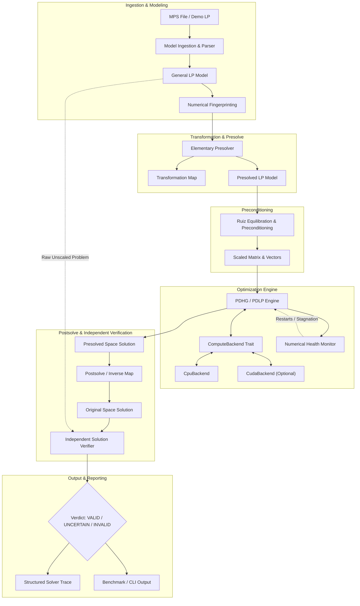

# Yutki-Samadhata: System Architecture Specification

## 1. High-Level Vision & Architecture

**Yutki-Samadhata** is an indigenous, first-principles Linear Programming optimization engine built in Rust with modular compute backends (CPU and CUDA/GPU). The solver is built around the **Primal-Dual Hybrid Gradient (PDHG / PDLP)** algorithm, specifically optimized for massive parallel sparse matrix-vector computations.



---

## 2. Workspace Modular Decomposition

The project is structured as a unified Cargo workspace composed of decoupled, highly focused crates:

```
yutki-samadhata/
│
├── Cargo.toml                     # Workspace configuration
│
├── crates/
│   ├── yutki-cli/                 # Main CLI binary, ASCII terminal UI, interactive menus
│   ├── yutki-auth/                # Argon2id authentication, local credential store, recovery codes
│   ├── yutki-model/               # General LP data structures, MPS parser, model validation
│   ├── yutki-sparse/              # COO, CSR, CSC sparse matrices, contiguous storage
│   ├── yutki-numerics/            # Central tolerances, Ruiz scaling, Pock-Chambolle, NaN sentinels
│   ├── yutki-transform/           # Elementary presolve passes, TransformationMap, postsolve restoration
│   ├── yutki-gpu/                 # ComputeBackend trait, CpuBackend, CudaBackend (FFI), auto-probe
│   ├── yutki-lp/                  # PDHG / PDLP algorithm, iteration controller, restart heuristics
│   ├── yutki-verifier/            # Decoupled independent solution verifier
│   ├── yutki-bench/               # Directory benchmarking harness, CSV and JSON reporting
│   └── yutki-runtime/             # Logging subsystem (human, json, quiet), structured event stream
│
├── cpp/
│   └── cpu/                       # Optional low-level C++ AVX/SIMD numerical kernels
│
├── cuda/
│   └── kernels/                   # Optional CUDA SpMV, transpose SpMV, reductions
│
├── examples/
│   └── demo/                      # Demonstration LP instances (e.g. production.mps)
│
├── docs/                          # Comprehensive technical design documents
├── benchmarks/                    # Benchmark test suites and output reports
└── tests/                         # Integration test suites
```

---

## 3. Crate Responsibilities & Boundaries

### 3.1 `yutki-cli`
- Top-level binary executable: `yutki-samadhata`.
- Implements the sovereign terminal visual language: dotted borders, ASCII banners, status indicators.
- Manages command-line argument parsing (subcommands: `start`, `solve`, `benchmark`, `info`).
- Drives the interactive terminal loops (authentication gate, solver dashboard).

### 3.2 `yutki-auth`
- Handles user signup, credential verification, recovery token generation, and password resets.
- Zero network or database footprint; operates strictly via local encrypted/hashed JSON file.
- Enforces Argon2id hashing for both passwords and recovery keys.

### 3.3 `yutki-model`
- Internal representation of general LP:
  $$
  \min c^T x \quad \text{s.t.} \quad l_c \le A x \le u_c, \quad l_v \le x \le u_v
  $$
- Parses standard MPS format with full support for `NAME`, `ROWS`, `COLUMNS`, `RHS`, `RANGES`, and `BOUNDS`.
- Validates model coherence (finite bounds, consistent dimensions, non-empty structures).

### 3.4 `yutki-sparse`
- Memory-efficient sparse formats:
  - `CooMatrix`: Triplets $(i, j, v)$ for incremental matrix building.
  - `CsrMatrix`: Fast row-wise indexing for $A x$ multiplications.
  - `CscMatrix`: Fast column-wise indexing for $A^T y$ transposed multiplications.
- Enforces contiguous memory layout to prevent cache misses.

### 3.5 `yutki-numerics`
- Provides the single source of truth for all numerical tolerances (`NumericalTolerances`).
- Problem conditioning fingerprint (dynamic range of matrix elements, objective, RHS).
- Matrix equilibration: Ruiz scaling and Pock-Chambolle step-size preconditioning.
- Runtime sanity checks (NaN, Inf, denormal detection).

### 3.6 `yutki-transform`
- Basic presolve transformations:
  1. Removal of fixed variables ($l_{v, j} = u_{v, j}$).
  2. Removal of empty rows and empty columns.
  3. Elimination of zero matrix entries.
  4. Bound tightening on singleton rows.
- Maintains `TransformationMap` tracking dropped coordinates, index remappings, and constant objective shifts.
- Implements exact inverse transformation (`postsolve`) restoring solutions to original coordinate space.

### 3.7 `yutki-gpu`
- Defines the `ComputeBackend` interface for matrix/vector operations and projections.
- Implements `CpuBackend` (multi-threaded, portable, always functional).
- Implements `CudaBackend` (CUDA runtime bindings, custom kernels).
- Implements backend selection logic: `--backend cpu`, `--backend gpu`, `--backend auto`.

### 3.8 `yutki-lp`
- Mathematical PDHG / PDLP solver orchestration.
- Manages primal/dual vectors, extrapolation updates, step sizes, ergodic running averages, and restarts.
- Interfaces exclusively with `ComputeBackend` trait.

### 3.9 `yutki-verifier`
- Independent auditor evaluating raw candidate solutions against unscaled original models.
- Recomputes constraint satisfaction and objective values independently of solver code.
- Emits conclusive verdicts: `VALID`, `NUMERICALLY_UNCERTAIN`, `INVALID`.

### 3.10 `yutki-bench`
- Traverses directories containing `.mps` instances.
- Executes solver with specified options and aggregates performance metrics.
- Emits transparent reports in CSV and JSON formats.

### 3.11 `yutki-runtime`
- Centralized structured logging and event emission.
- Formats: `--log human` (terminal tables/bulletins), `--log json` (machine-readable NDJSON), `--log quiet`.

---

## 4. Architectural Guarantees & Constraints
- **Zero Commercial Wrappers:** No third-party solver libraries (CBC, HiGHS, SCIP, Gurobi, CPLEX).
- **GPU Transparency:** GPU execution is only reported when genuinely dispatched on a physical CUDA device.
- **Fail-Safe Numerics:** Never return `Optimal` status without residual verification.
