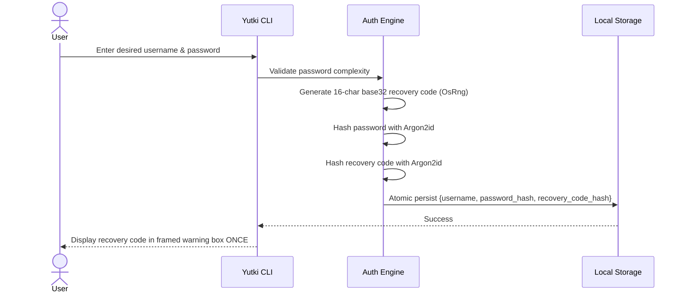
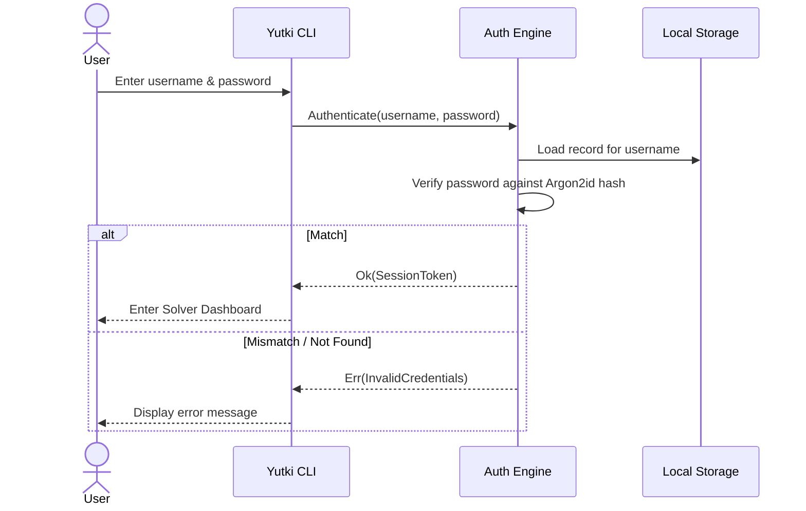
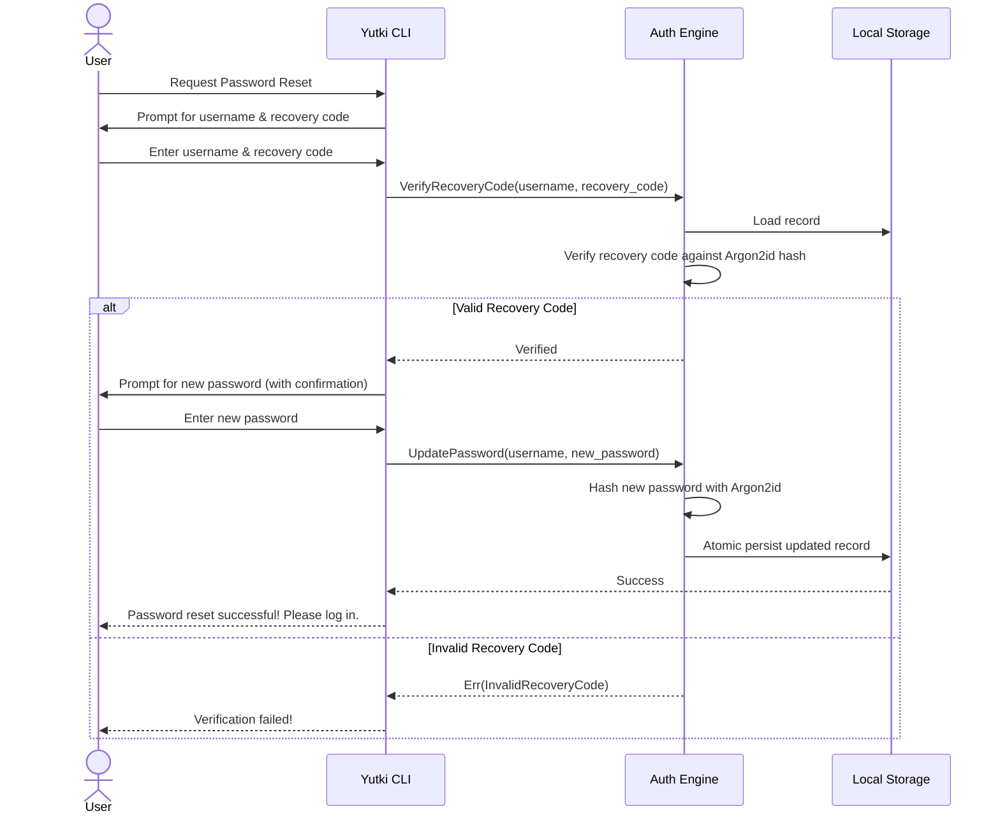

# Yutki-Samadhata: Local Authentication Architecture

## 1. Security Mandates & Principles

1. **Zero External Dependencies:**
   - No web servers, no REST/gRPC endpoints, no cloud authentication, no database engines (no PostgreSQL/MySQL/SQLite required).
   - Local, self-contained single-file state with atomic write semantics.

2. **Zero Plaintext Credentials:**
   - Passwords and recovery codes are **never** stored, cached, or emitted in plaintext anywhere on disk or in log streams.

3. **Modern Cryptographic Standards:**
   - Hashing Algorithm: **Argon2id** (RFC 9106 recommended profile: memory cost 19,456 KiB, time cost 2 iterations, parallelism 1 lane, random 16-byte cryptographically secure salt).
   - Random Generation: OS cryptographically secure random number generator (`rand::rngs::OsRng`).

---

## 2. Storage Layout & Data Schema

Auth state is stored in a local directory with restricted user permissions (e.g., `~/.yutki/auth_store.json` or `$YUTKI_HOME/auth_store.json`):

```json
{
  "version": 1,
  "users": {
    "engineer_admin": {
      "username": "engineer_admin",
      "password_hash": "$argon2id$v=19$m=19456,t=2,p=1$...",
      "recovery_code_hash": "$argon2id$v=19$m=19456,t=2,p=1$...",
      "created_at_utc": 1773835200,
      "last_login_utc": 1773838800
    }
  }
}
```

---

## 3. Workflows

### 3.1 Signup Flow


### 3.2 Login Flow


### 3.3 Forgot Password Flow


### 3.4 Logout Flow
- Destroys active in-memory session object.
- Returns terminal to the top-level main menu.
