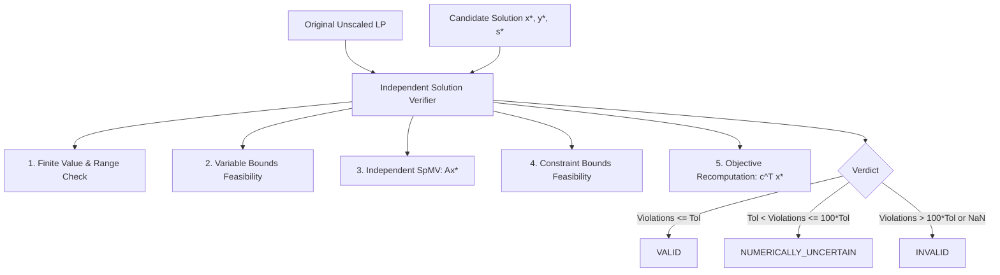

# Yutki-Samadhata: Numerical Robustness & Verification Design

## 1. Centralized Numerical Tolerances

Numerical constants must never be hardcoded into algorithmic loops. All tolerances are unified in `NumericalTolerances`:

```rust
#[derive(Debug, Clone, Copy, PartialEq, Serialize, Deserialize)]
pub struct NumericalTolerances {
    /// Relative primal feasibility tolerance (default: 1e-6)
    pub primal_tol: f64,

    /// Relative dual feasibility tolerance (default: 1e-6)
    pub dual_tol: f64,

    /// Relative duality gap tolerance (default: 1e-6)
    pub gap_tol: f64,

    /// Zero threshold below which numbers are treated as exact 0.0 (default: 1e-12)
    pub zero_tol: f64,

    /// Numerical threshold above which values are treated as infinity (default: 1e20)
    pub infinity_threshold: f64,

    /// Maximum condition ratio max(|A_ij|)/min(|A_ij|) before warning (default: 1e8)
    pub max_condition_ratio: f64,

    /// Stagnation progress window in iterations (default: 50)
    pub stagnation_window: usize,

    /// Minimum relative progress over stagnation window (default: 1e-4)
    pub stagnation_threshold: f64,

    /// Maximum allowed iterations before timeout / limit (default: 50,000)
    pub max_iterations: usize,

    /// Maximum wall-clock time limit in seconds (default: 300.0)
    pub time_limit_secs: f64,
}

impl Default for NumericalTolerances {
    fn default() -> Self {
        Self {
            primal_tol: 1e-6,
            dual_tol: 1e-6,
            gap_tol: 1e-6,
            zero_tol: 1e-12,
            infinity_threshold: 1e20,
            max_condition_ratio: 1e8,
            stagnation_window: 50,
            stagnation_threshold: 1e-4,
            max_iterations: 50_000,
            time_limit_secs: 300.0,
        }
    }
}
```

---

## 2. Numerical Invariants & Runtime Health Checks

### 2.1 NaN / Inf Sentinel Protection
- **Check Frequency:** Verified every iteration or during checkpoint evaluation on all state vectors $(x, y, s, \bar{x})$.
- **Action:** If any element is `NaN` or `+/-Inf`:
  - Flag immediate `NumericalEvent::NaNInfDetected { vector: "x", index: j, value: ... }`.
  - Abort iterative solve immediately with `SolverStatus::NumericalFailure`.
  - Never propagate unphysical numbers into subsequent iterations.

### 2.2 Dynamic Dynamic Range & Fingerprinting
During ingestion and validation, the engine computes a problem fingerprint:
- Matrix coefficient range: $\min_{|A_{ij}| > 0} |A_{ij}|$ and $\max |A_{ij}|$.
- Dynamic range ratio: $\rho = \frac{\max |A_{ij}|}{\min_{|A_{ij}| > 0} |A_{ij}|}$.
- Cost coefficient range: $\min_{|c_j| > 0} |c_j|$ and $\max |c_j|$.
- RHS range: $\min_{|b_i| > 0} |b_i|$ and $\max |b_i|$.
If $\rho > 10^8$, emit structured warning: `NumericalWarning::SevereIllConditioning { ratio: rho }` and recommend Ruiz scaling passes.

### 2.3 Stagnation Detection & Recovery
- Maintains a circular buffer of the last $W$ KKT errors.
- If relative improvement over $W$ iterations satisfies:
  $$
  \frac{\text{err}_{k-W} - \text{err}_k}{\text{err}_{k-W}} < \text{stagnation\_threshold}
  $$
- The engine triggers an adaptive recovery:
  1. Force step-size rebalancing (adjust primal-dual step ratio $\tau / \sigma$).
  2. Perform an explicit restart to the best-known ergodic average point.
  3. If stagnation persists for 3 consecutive recovery cycles, conclude with `SolverStatus::Stagnation` instead of looping endlessly.

---

## 3. Independent Solution Verifier

The `SolutionVerifier` is completely decoupled from the PDHG solver. It receives the original unscaled LP problem and the computed candidate solution $(x^*, y^*, s^*)$ and independently evaluates feasibility and optimality.



### 3.1 Verification Metrics
1. **Variable Bound Violation:**
   $$
   v_{\text{var}} = \max_{j} \left( \max(0, l_{v, j} - x_j^*), \max(0, x_j^* - u_{v, j}) \right)
   $$
2. **Row Constraint Violation:**
   Compute $r_i = \sum_{j} A_{ij} x_j^*$ using an independent high-precision scalar accumulator:
   $$
   v_{\text{row}} = \max_{i} \left( \max(0, l_{c, i} - r_i), \max(0, r_i - u_{c, i}) \right)
   $$
3. **Objective Discrepancy:**
   $$
   \Delta_{\text{obj}} = | c^T x^* - \text{reported\_obj} |
   $$

### 3.2 Verdict Classifications
- `VALID`: $v_{\text{var}} \le \epsilon_{\text{tol}}$ AND $v_{\text{row}} \le \epsilon_{\text{tol}}$ AND $\Delta_{\text{obj}} \le 10 \cdot \epsilon_{\text{zero}}$.
- `NUMERICALLY_UNCERTAIN`: $\epsilon_{\text{tol}} < \max(v_{\text{var}}, v_{\text{row}}) \le 100 \cdot \epsilon_{\text{tol}}$.
- `INVALID`: $\max(v_{\text{var}}, v_{\text{row}}) > 100 \cdot \epsilon_{\text{tol}}$ OR presence of non-finite numbers.
